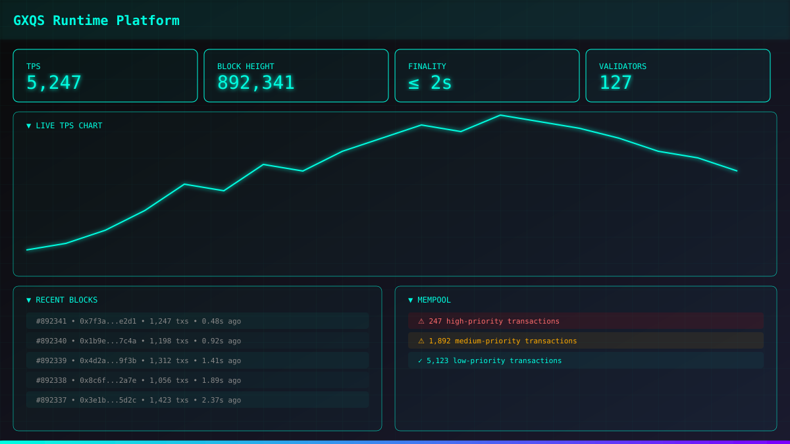
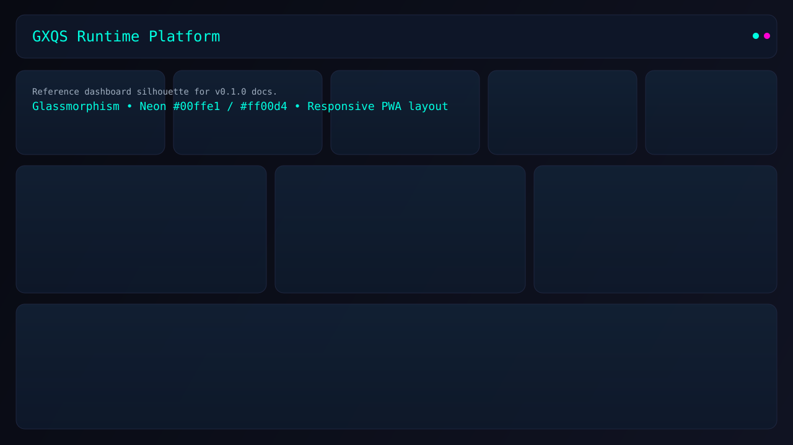

# GXQS Distributed Compute Operating Platform

> Unified control plane for wallet, mining, validation, and deployment.

GXQS is **not** a wallet app. It is an enterprise blockchain operating platform that combines:

- 🔐 **Universal Identity Layer** – one cryptographic root controlling wallet signing, mining authentication, validator authorization, and enterprise deployment permissions
- ⚡ **Runtime Supervisor** – Kubernetes-style daemon orchestration (walletd, minerd, validatord, telemetryd, deployerd)
- 🦀 **Rust Crypto Core** – AES-256-GCM vault, memory-safe (zeroize-on-drop), WASM-capable
- 🐹 **Go Protocol Bridge** – walletd JSON-RPC server, GXQS address derivation, transaction builder
- 🌐 **Web Dashboard** – Next.js + Tailwind + Zustand enterprise monitoring UI (`#00ffe1` glow system)
- 🧠 **Smart Wallet Flow (walletd-mediated placeholders)**:
  - one-click onboarding UX and registration/import/export request surfaces
  - network/RPC profile toggles and auth onboarding placeholders
  - secret material remains inside `walletd`
- 📱 **Mobile App** – React Native + Expo cross-platform client (`apps/mobile`)
- 📋 **Policy Engine** – YAML-driven enterprise policy enforcement (compute limits, validator rules, fleet policies)
- 🐳 **Production Infrastructure** – Docker, Kubernetes (Kustomize), Prometheus, Grafana

---

## Architecture

```mermaid
graph TD
    CORE["GXQS/core\n(Protocol Authority)"]
    EXP["GXQS/Exployer\n(Explorer + Contracts Indexer)"]

    subgraph Wallet["GXQS/Wallet — Control Plane"]
        WD["walletd\n(Go JSON-RPC bridge)\n• Address derivation\n• Tx builder / signer\n• Vault gateway"]
        VAULT["Rust Crypto Core\n• AES-256-GCM vault\n• zeroize-on-drop SecretKey\n• WASM bindings"]
        SUP["Runtime Supervisor\n(Go)\n• walletd  • minerd\n• validatord  • telemetryd\n• deployerd"]
        PE["Policy Engine\n(Go + YAML)\n• CPU/GPU limits\n• Fleet policies\n• Validator rules"]
    end

    subgraph Frontends["Untrusted Presentation Layer"]
        WEB["Web Dashboard\n(Next.js 16)\n#00ffe1 glow system"]
        DESK["Desktop\n(Tauri)"]
        MOB["Mobile\n(React Native + Expo)"]
        BROWSER["Browser Compute\n(WASM + WebGPU)"]
    end

    CORE -->|protocol types| WD
    WD <-->|vault R/W| VAULT
    SUP -->|spawn / health-check| WD
    PE -->|policy enforcement| SUP
    WEB -->|RPC over HTTP| WD
    WEB -->|index + contract sync hooks| EXP
    EXP -->|network analytics + contract state| WEB
    DESK -->|RPC over IPC| WD
    MOB -->|RPC over HTTP| WD
    BROWSER -->|WASM| VAULT
```



### Non-Negotiable Security Rules

| Rule                          | Detail                                                                                |
| ----------------------------- | ------------------------------------------------------------------------------------- |
| ‚ùå **No key exposure**        | Private keys never leave `walletd`; renderer/UI processes receive only signed outputs |
| ‚ùå **No vault access**        | Mining runtimes operate without any vault access                                      |
| ‚ùå **No signing duplication** | All signing originates from `walletd`; no frontend reimplementation                   |
| ‚úÖ **Authenticated IPC**      | All RPC channels require authentication + scoped permissions                          |
| ‚úÖ **Untrusted surfaces**     | Web, Desktop, Mobile, and Browser runtimes are treated as untrusted                   |

---

## Repository Structure

```
wallet/
├── apps/
│   ├── web/                   # Next.js 16 enterprise dashboard
│   └── mobile/                # React Native + Expo mobile app
├── packages/
│   ├── sdk/                   # TypeScript SDK (@gxqs/sdk)
│   └── ui/                    # Shared UI components (@gxqs/ui)
├── runtime/
│   ├── gxqs-runtime/          # Runtime supervisor (watchdog)
│   ├── protocol/
│   │   └── go-rpc-bridge/     # Go JSON-RPC walletd
│   ├── policy-engine/         # YAML enterprise policy engine
│   └── crypto/
│       └── gxqs-wallet-core-rs/  # Rust: AES-256-GCM vault + WASM
├── infra/
│   ├── docker/                # Dockerfiles + Docker Compose
│   ├── kubernetes/            # Kustomize base manifests
│   └── observability/         # Prometheus + Grafana configs
├── api/                       # OpenAPI spec (walletd)
├── scripts/                   # bootstrap.sh / bootstrap.ps1
└── .github/workflows/         # CI: Go, Rust, TypeScript, WASM
```

---

## Quick Start

### Option A — One-command bootstrap (recommended)

**Linux / macOS:**

```bash
# Installs go 1.25.10, Rust 1.95, Node 24, pnpm, then builds everything
bash scripts/bootstrap.sh
make build
```

**Windows (PowerShell):**

```powershell
# Run from repo root
.\scripts\bootstrap.ps1
make build
```

### Option B — Manual setup

**Prerequisites:** Go 1.25.10+, Rust 1.95+, Node.js 24+, pnpm 11+

```bash
# 1 — TypeScript packages
pnpm install

# 2 — Start web dashboard (dev)
pnpm --filter @gxqs/web dev

# 3 — Validate frontend quality gates
pnpm format:check
pnpm lint
pnpm typecheck
pnpm test

# 4 — Run walletd (Go)
cd runtime/protocol/go-rpc-bridge && go run ./cmd/walletd

# 5 — Verify
curl http://localhost:8545/healthz
curl http://localhost:8545/rpc/v1/version
```

## Developer Commit Workflow

Pre-commit checks are enforced with Lefthook in strict order:

1. `pnpm generated:guard` removes non-material generated-file drift from staging.
2. `pnpm format:staged` (via `lint-staged`) runs `prettier --write` on staged files only.
3. `pnpm format:check:staged` applies strict `prettier --check` to staged files.
4. `pnpm lint` and `pnpm typecheck` enforce static quality gates.

This prevents manual formatting misses while preserving strict enforcement.

For generated file classification and commit behavior, see:

- `docs/GENERATED_FILE_POLICY.md`
- `docs/CONTRIBUTOR_WORKFLOW.md`

### Useful Commands

```bash
# Format only staged files (same behavior as pre-commit step)
pnpm format:staged

# Strictly verify formatting on staged files
pnpm format:check:staged

# Format full repository
pnpm format

# Verify formatting without writing changes
pnpm format:check
```

## ??? Dashboard Screenshot



*Enterprise dashboard featuring:*
- **Real-time telemetry** ñ Live TPS, block height, finality, validator count
- **Neon glow system** ñ `#00ffe1` primary glow with state-driven animations
- **Glassmorphism UI** ñ Frosted glass effects with depth levels
- **Responsive design** ñ Mobile-first adaptive layout with bottom navigation
- **Live charts** ñ Collapsible TPS chart with auto-refresh
- **Block stream** ñ Real-time block updates with SSE streaming
- **Mempool monitor** ñ Priority-based transaction visualization

> **Note:** This is a representative screenshot. The actual dashboard is fully interactive with live Core gRPC data.




### Adaptive UI Documentation

- `docs/architecture/MOBILE_FIRST_ADAPTIVE_UI.md`
- `docs/RESPONSIVE_STORYBOOK_DOCS.md`

### Full stack (Docker Compose)

```bash
cd infra/docker
docker compose up -d
# Web dashboard ‚Üí http://localhost:3000
# walletd RPC   ‚Üí http://localhost:8545
# Grafana       ‚Üí http://localhost:3001  (admin / changeme)
# Prometheus    ‚Üí http://localhost:9090
```

### Makefile targets

```
make help        Show all targets
make bootstrap   Install all toolchains + dependencies
make build       Build all (Go, Rust, TypeScript)
make test        Run all tests
make lint        Lint all workspaces
make typecheck   TypeScript type-check
make audit       Security audit (pnpm + cargo)
make fmt         Format all code
make docker      Build Docker images
make k8s         Apply Kubernetes manifests
make clean       Remove build artifacts
```

---

## CI/CD

All pull requests must pass:

| Gate             | Tool                                          |
| ---------------- | --------------------------------------------- |
| TypeScript check | `tsc --noEmit`                                |
| Go vet           | `go vet`                                      |
| Rust clippy      | `cargo clippy`                                |
| Rust fmt         | `cargo fmt`                                   |
| npm audit        | `pnpm audit`                                  |
| cargo audit      | `cargo audit`                                 |
| WASM build       | `cargo build --target wasm32-unknown-unknown` |
| Prettier format  | `prettier --check`                            |

CI runs on **Ubuntu**, **Windows**, and **macOS** for all language stacks.

---

## Security Model

| Process    | Vault Access | Network Access | UI Access |
| ---------- | :----------: | :------------: | :-------: |
| walletd    |    ‚úÖ R/W    | Internal only  |    ‚ùå     |
| minerd     |      ‚ùå      | Pool RPC only  |    ‚ùå     |
| validatord |      ‚ùå      | Consensus RPC  |    ‚ùå     |
| telemetryd |      ‚ùå      | Telemetry sink |    ‚ùå     |
| Web UI     |      ‚ùå      |  walletd IPC   |    ‚úÖ     |
| Browser    |      ‚ùå      | Pool RPC only  |    ‚úÖ     |

---


## ? Modern UI Features

| Feature | Description |
|---------|-------------|
| **Neon Glow System** | State-driven glow effects (hover, active, critical) with `#00ffe1` primary |
| **Glassmorphism** | Three depth levels (L1/L2/L3) with backdrop blur and translucent borders |
| **Responsive Navigation** | Sidebar on desktop ? Bottom nav with expandable tray on mobile |
| **Live Streaming** | Server-Sent Events (SSE) for blocks and events ñ no browser gRPC |
| **Collapsible Charts** | Toggle charts on mobile, memoized for performance |
| **Dark Theme** | Cyberpunk-inspired dark interface with high contrast |

## License

Apache-2.0 © GXQS Platform Team
