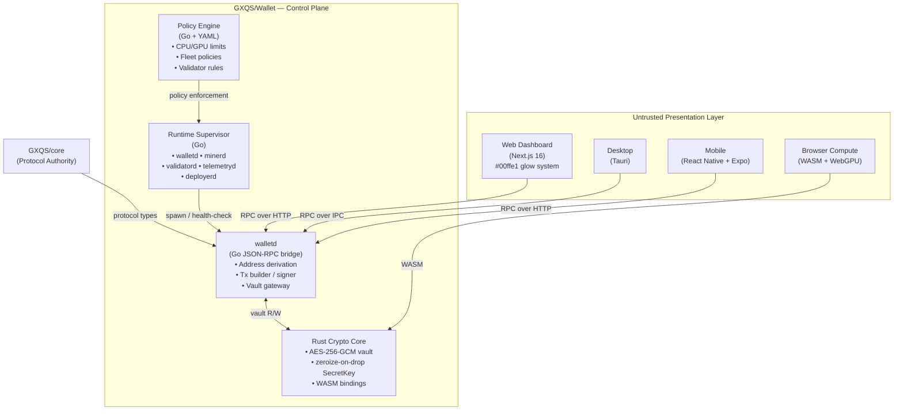

# GXQS Distributed Compute Operating Platform

> Unified control plane for wallet, mining, validation, and deployment.

GXQS is **not** a wallet app. It is an enterprise blockchain operating platform that combines:

- 🔐 **Universal Identity Layer** – one cryptographic root controlling wallet signing, mining authentication, validator authorization, and enterprise deployment permissions
- ⚡ **Runtime Supervisor** – Kubernetes-style daemon orchestration (walletd, minerd, validatord, telemetryd, deployerd)
- 🦀 **Rust Crypto Core** – AES-256-GCM vault, memory-safe (zeroize-on-drop), WASM-capable
- 🐹 **Go Protocol Bridge** – walletd JSON-RPC server, GXQS address derivation, transaction builder
- 🌐 **Web Dashboard** – Next.js + Tailwind + Zustand enterprise monitoring UI (`#00ffe1` glow system)
- 📱 **Mobile App** – React Native + Expo cross-platform client (`apps/mobile`)
- 📋 **Policy Engine** – YAML-driven enterprise policy enforcement (compute limits, validator rules, fleet policies)
- 🐳 **Production Infrastructure** – Docker, Kubernetes (Kustomize), Prometheus, Grafana

---

## Architecture



### Non-Negotiable Security Rules

| Rule                          | Detail                                                                                |
| ----------------------------- | ------------------------------------------------------------------------------------- |
| ❌ **No key exposure**        | Private keys never leave `walletd`; renderer/UI processes receive only signed outputs |
| ❌ **No vault access**        | Mining runtimes operate without any vault access                                      |
| ❌ **No signing duplication** | All signing originates from `walletd`; no frontend reimplementation                   |
| ✅ **Authenticated IPC**      | All RPC channels require authentication + scoped permissions                          |
| ✅ **Untrusted surfaces**     | Web, Desktop, Mobile, and Browser runtimes are treated as untrusted                   |

---

## Repository Structure

```
wallet/
├── apps/
│   ├── web/                   # Next.js 16 enterprise dashboard
│   └── mobile/                # React Native + Expo mobile app
├── packages/
│   ├── sdk/                   # TypeScript SDK (@gxqs/sdk)
│   └── ui/                    # Shared UI components (@gxqs/ui)
├── runtime/
│   ├── gxqs-runtime/          # Runtime supervisor (watchdog)
│   ├── protocol/
│   │   └── go-rpc-bridge/     # Go JSON-RPC walletd
│   ├── policy-engine/         # YAML enterprise policy engine
│   └── crypto/
│       └── gxqs-wallet-core-rs/  # Rust: AES-256-GCM vault + WASM
├── infra/
│   ├── docker/                # Dockerfiles + Docker Compose
│   ├── kubernetes/            # Kustomize base manifests
│   └── observability/         # Prometheus + Grafana configs
├── api/                       # OpenAPI spec (walletd)
├── scripts/                   # bootstrap.sh / bootstrap.ps1
└── .github/workflows/         # CI: Go, Rust, TypeScript, WASM
```

---

## Quick Start

### Option A — One-command bootstrap (recommended)

**Linux / macOS:**

```bash
# Installs Go 1.24, Rust 1.95, Node 24, pnpm, then builds everything
bash scripts/bootstrap.sh
make build
```

**Windows (PowerShell):**

```powershell
# Run from repo root
.\scripts\bootstrap.ps1
make build
```

### Option B — Manual setup

**Prerequisites:** Go 1.24+, Rust 1.95+, Node.js 24+, pnpm 11+

```bash
# 1 — TypeScript packages
pnpm install

# 2 — Start web dashboard (dev)
pnpm --filter @gxqs/web dev

# 3 — Run walletd (Go)
cd runtime/protocol/go-rpc-bridge && go run ./cmd/walletd

# 4 — Verify
curl http://localhost:8545/healthz
curl http://localhost:8545/rpc/v1/version
```

### Full stack (Docker Compose)

```bash
cd infra/docker
docker compose up -d
# Web dashboard → http://localhost:3000
# walletd RPC   → http://localhost:8545
# Grafana       → http://localhost:3001  (admin / changeme)
# Prometheus    → http://localhost:9090
```

### Makefile targets

```
make help        Show all targets
make bootstrap   Install all toolchains + dependencies
make build       Build all (Go, Rust, TypeScript)
make test        Run all tests
make lint        Lint all workspaces
make typecheck   TypeScript type-check
make audit       Security audit (pnpm + cargo)
make fmt         Format all code
make docker      Build Docker images
make k8s         Apply Kubernetes manifests
make clean       Remove build artifacts
```

---

## CI/CD

All pull requests must pass:

| Gate             | Tool                                          |
| ---------------- | --------------------------------------------- |
| TypeScript check | `tsc --noEmit`                                |
| Go vet           | `go vet`                                      |
| Rust clippy      | `cargo clippy`                                |
| Rust fmt         | `cargo fmt`                                   |
| npm audit        | `pnpm audit`                                  |
| cargo audit      | `cargo audit`                                 |
| WASM build       | `cargo build --target wasm32-unknown-unknown` |
| Prettier format  | `prettier --check`                            |

CI runs on **Ubuntu**, **Windows**, and **macOS** for all language stacks.

---

## Security Model

| Process    | Vault Access | Network Access | UI Access |
| ---------- | :----------: | :------------: | :-------: |
| walletd    |    ✅ R/W    | Internal only  |    ❌     |
| minerd     |      ❌      | Pool RPC only  |    ❌     |
| validatord |      ❌      | Consensus RPC  |    ❌     |
| telemetryd |      ❌      | Telemetry sink |    ❌     |
| Web UI     |      ❌      |  walletd IPC   |    ✅     |
| Browser    |      ❌      | Pool RPC only  |    ✅     |

---

## License

MIT © GXQS Platform Team
